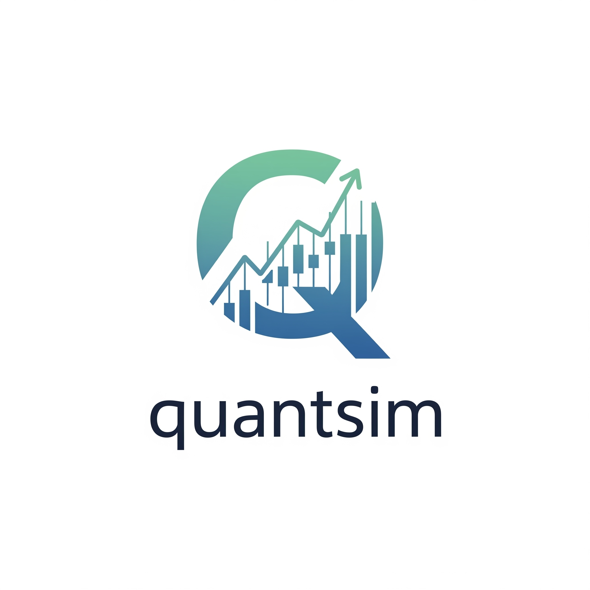
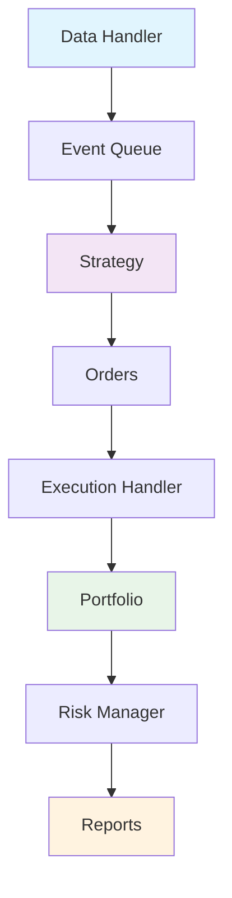

# QuantSim Documentation

<div align="center">
    
    <h2>Professional Event-Driven Backtesting Framework</h2>
    <p><em>Build, test, and deploy quantitative trading strategies with confidence</em></p>
</div>

---

[](https://github.com/yash-tr/quantsim/actions)
[](https://pypi.org/project/quantsim/)
[](https://pypi.org/project/quantsim/)
[](https://github.com/yash-tr/quantsim/blob/main/LICENSE)
[](https://github.com/yash-tr/quantsim/actions)

## What is QuantSim?

**QuantSim** is a cutting-edge, event-driven backtesting framework designed for quantitative traders, researchers, and financial institutions. It provides institutional-grade simulation capabilities with a focus on **performance**, **accuracy**, and **extensibility**.

!!! tip "Why Choose QuantSim?"
    - 🏗️ **Event-Driven Architecture** - Realistic simulation processing market events chronologically
    - ⚡ **High Performance** - Optimized for speed with comprehensive caching and vectorized operations  
    - 🧪 **Battle-Tested** - 178 unit tests with 95%+ coverage ensuring reliability
    - 🔧 **Highly Extensible** - Plugin architecture for strategies, indicators, and execution models
    - 🤖 **ML Integration** - Optional machine learning components for advanced strategies

## Quick Start

Get up and running with QuantSim in under 5 minutes:

### Installation

=== "Core Package"
    ```bash
    pip install quantsim
    ```

=== "With ML Features"
    ```bash
    pip install quantsim[ml]
    ```

=== "Full Installation"
    ```bash
    pip install quantsim[ml,pairs]
    ```

### Your First Strategy

```python
import quantsim as qs

# Create and run a simple SMA crossover strategy
engine = qs.SimulationEngine(
    data_source='yahoo',
    symbols=['AAPL'],
    start_date='2022-01-01',
    end_date='2023-01-01',
    strategy='sma_crossover',
    initial_capital=100000
)

results = engine.run()
print(f"Total Return: {results.total_return:.2%}")
print(f"Sharpe Ratio: {results.sharpe_ratio:.2f}")
```

## Core Features

<div class="grid cards" markdown>

-   :material-chart-line:{ .lg .middle } **Advanced Strategies**

    ---

    Built-in strategies including SMA crossover, momentum, mean reversion, and pairs trading with ML integration support.

    [:octicons-arrow-right-24: Learn about strategies](user-guide/strategies.md)

-   :material-database:{ .lg .middle } **Multiple Data Sources**

    ---

    Support for Yahoo Finance, CSV files, and synthetic data generation with automatic symbol validation.

    [:octicons-arrow-right-24: Explore data sources](user-guide/data-sources.md)

-   :material-cog:{ .lg .middle } **Portfolio Management**

    ---

    Real-time P&L tracking, risk metrics, position management, and comprehensive trade logging.

    [:octicons-arrow-right-24: Portfolio features](user-guide/portfolio.md)

-   :material-chart-box:{ .lg .middle } **Professional Reporting**

    ---

    Rich markdown reports with equity curves, performance metrics, and detailed analytics.

    [:octicons-arrow-right-24: View reporting](user-guide/reporting.md)

</div>

## Architecture Overview



## Performance Metrics

QuantSim calculates comprehensive performance metrics to evaluate your strategies:

| Metric | Description |
|--------|-------------|
| **Total Return** | Cumulative return over the backtest period |
| **Sharpe Ratio** | Risk-adjusted return measure |
| **Maximum Drawdown** | Largest peak-to-trough decline |
| **Win Rate** | Percentage of profitable trades |
| **Profit Factor** | Ratio of gross profits to gross losses |

## Community & Support

<div class="grid cards" markdown>

-   :fontawesome-brands-github:{ .lg .middle } **Open Source**

    ---

    QuantSim is open source and welcomes contributions from the community.

    [:octicons-arrow-right-24: Contribute on GitHub](https://github.com/yash-tr/quantsim)

-   :material-book-open:{ .lg .middle } **Documentation**

    ---

    Comprehensive guides, tutorials, and API reference to get you started.

    [:octicons-arrow-right-24: Browse documentation](getting-started/installation.md)

-   :material-chat:{ .lg .middle } **Community**

    ---

    Join our discussions for tips, strategies, and support from other traders.

    [:octicons-arrow-right-24: Join discussions](https://github.com/yash-tr/quantsim/discussions)

-   :material-bug:{ .lg .middle } **Support**

    ---

    Found a bug or need help? We're here to assist you.

    [:octicons-arrow-right-24: Get support](community/support.md)

</div>

## What's Next?

Ready to start building your trading strategies? Here are some suggested next steps:

1. **[Install QuantSim](getting-started/installation.md)** - Get QuantSim installed on your system
2. **[Quick Start Guide](getting-started/quickstart.md)** - Build your first strategy in minutes  
3. **[Basic Concepts](getting-started/concepts.md)** - Understand the core concepts
4. **[Examples](examples/sma-crossover.md)** - Explore real strategy examples
5. **[API Reference](api/core.md)** - Dive deep into the API documentation

---

<div align="center">
    <p><strong>Ready to transform your trading strategies?</strong></p>
    <p><a href="getting-started/installation.md" class="md-button md-button--primary">Get Started Now</a></p>
</div> 